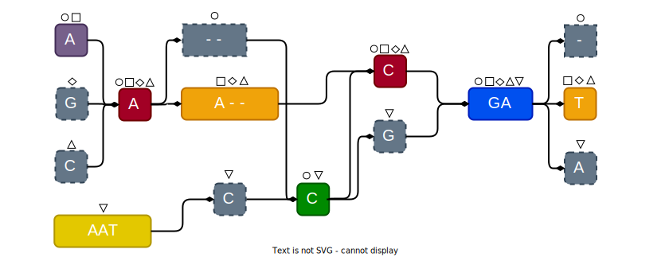
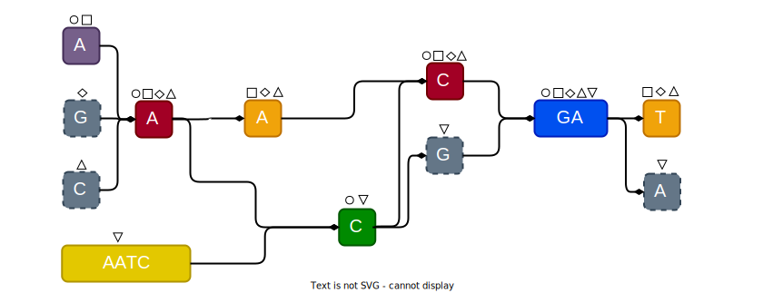

# **Customized construction of pangenome graphs via maximal blocks**

## How to run

### Create a virtual environment

```bash
mamba env create -n pangeblocks -f envs/snakemake.yml
mamba activate pangeblocks
```

`pangeblocks` is a snakemake pipeline and it requires gurobi ([check license](https://www.gurobi.com/)). 
We provide a CLI that parses some command line options and produces the snakemake call to compute graphs from a directory with <msa>.fa files

```bash
usage: pangeblocks [-h] [--dir-msa DIR_MSA] [--dir-output DIR_OUTPUT] [--dir-subsolutions DIR_SUBSOLUTIONS] [--path-vert-blocks PATH_VERT_BLOCKS] [--log-level LOG_LEVEL]
                   [--obj-function {nodes,strings,weighted,depth,depth_and_len}] [--penalization PENALIZATION] [--min-len MIN_LEN] [--time-limit TIME_LIMIT]
                   [--threshold-vertical-blocks ALPHA] [--min-coverage MIN_COVERAGE] [--larger-decomposition] [--consistent] [--cores THREADS] [--submsa_threads SUBMSA_THREADS]
                   [--ilp-threads ILP_THREADS] [--max-memory MAX_MEMORY] [--min-rows-block MIN_ROWS_BLOCK] [--max-rows-block MAX_ROWS_BLOCK] [--max-msa-size MAX_MSA_SIZE]

options:
  -h, --help            show this help message and exit
  --dir-msa DIR_MSA     directory to MSAs in .fa format
  --dir-output DIR_OUTPUT
                        path to save the outputs in GFA format
  --dir-subsolutions DIR_SUBSOLUTIONS
                        directory where suboptimal coverage are saved
  --path-vert-blocks PATH_VERT_BLOCKS
                        json file with vertical blocks
  --log-level LOG_LEVEL
                        set log level (ERROR/WARNING/INFO/DEBUG)
  --obj-function {nodes,strings,weighted,depth,depth_and_len}
                        the objective function to optimize
  --penalization PENALIZATION
                        used only with the 'weighted', 'depth', and 'depth_and_len' obj function
  --min-len MIN_LEN     used only with the 'weighted' obj function
  --time-limit TIME_LIMIT
                        Timeout (in minutes) to stop ILP
  --threshold-vertical-blocks ALPHA
                        minimum width of a vertical block
  --min-coverage MIN_COVERAGE
                        used only with 'depth' obj function
  --larger-decomposition
                        if True, use complete-decomposition of blocks, otherwise use row-maximal decomposition
  --consistent          use an alpha-consistent strategy
  --cores THREADS       Number of cores to be used
  --submsa_threads SUBMSA_THREADS
  --ilp-threads ILP_THREADS
  --max-memory MAX_MEMORY
                        Maximum RAM used (in MBytes)
  --min-rows-block MIN_ROWS_BLOCK
  --max-rows-block MAX_ROWS_BLOCK
  --max-msa-size MAX_MSA_SIZE
```

#### Example 

```bash
./pangeblocks --dir-msa test/sars-cov-2-subMSA --dir-output output-sars-cov-2 --obj-function weighted --penalization 100 --min-len 20
```
you will find the final graph in `output-sars-cov-2/gfa-unchop` 

### Run a grid experiment
___

To construct variation graphs from MSAs, run `pangeblocks`:
```bash
snakemake -s pangeblocks.smk -c16 --use-conda # variation graph as GFA
```

### Parameters

Set the parameters in `params.yml`:
```yaml
PATH_MSAS: /data/msas
PATH_OUTPUT: /data/output
OPTIMIZATION:
  OBJECTIVE_FUNCTION:  # list of objective functions to try
    - "nodes"
    - "strings"
    - "weighted"
    - "depth"
    - "depth_and_len"
  PENALIZATION: # used only with "weighted" and "depth"
    - 1000
  MIN_LEN: # used only with "weighted"
    - 15
    - 20
    - 25
    - 30
  MIN_COVERAGE: # used only with "depth"
    - 0.11
    - 0.3
    - 0.5
  THRESHOLD_VERTICAL_BLOCKS: # minimum length of vertical blocks to be fixed in the optimal solution
    - 1
    - 2
    - 8
    - 16
  TIME_LIMIT: 240 # time limit to run each ILP (minutes)
LOG_LEVEL: "INFO"
THREADS:
  SUBMSAS: 1 # ThreadPoolExecutor; 1 -> for loop
  ILP: 8     # gurobi threads
DECOMPOSITION:
  STANDARD: True          # True: use complete decomposition of blocks | False: use row-maximal decomposition of blocks
  ALPHA_CONSISTENT: False # True: use an alpha consistent decomposition of blocks
USE_WILDPBWT: True

# When spliting the MSA into subMSAs, they will have at most this number of cells/positions 
# this will limit the number of constraints used by the ILP. Eg: 100 rows x 1000 columns = 100000 positions
MAX_POSITIONS_SUBMSAS: 100000 # 200000 Row-maximal | 100000 Complete

# Maximal blocks with at least the following number of rows and columns will be fixed in the solution
MIN_ROWS_FIX_BLOCK: 0
MIN_COLS_FIX_BLOCK: 0
```

### Running under docker
___

To run `pangeblocks` on a small example (MSA with 10 rows and 200 columns), run
the following command, replacing `/tmp/pgb` with the directory that will contain
the results.

```
mkdir /tmp/pgb-out
docker run -it --user $(id -u):$(id -g) -v ./test/sars-cov-2-subMSA/:/data \
    --mount type=bind,source=/tmp/pgb-out,target=/results algolab/pangeblocks:latest
ls /tmp/pgb-out/sars-cov-2.gfa # <- this is the graph
```

If you want to run  `pangeblocks` on your data, you also have to provide the
directory containing the MSA, replacing `./test/sars-cov-2-subMSA/` with your
directory and adding the correct  `pangeblocks` call, specifying the arguments.
For example:

```
docker run -it --user $(id -u):$(id -g) \ 
-v ./DATADIR/:/data \
--mount type=bind,source=/tmp/pgb,target=/results \
algolab/pangeblocks:latest
/app/pangeblocks --path-msa /data/my.msa
```

___

## Considerations

- Maximal blocks are computed with the [Wild-PBWT](https://github.com/AlgoLab/Wild-pBWT)
- **Troubleshooting** Wild-PBWT requires SDSL, [check this to install it](https://github.com/msgr0/Wild-pBWT?tab=readme-ov-file#prerequisites)
- ILPs are solved using [Gurobi](https://www.gurobi.com/), you might need a license 
- Each MSA must be in the **ALPHABET** $\{A,C,G,T,-,N\}$ **Not** case sensitive. We recommend to map all characters not in the alphabet to N.

___

## How does it work?
___
`pangeblocks` creates a variation graph from an MSA by selecting a set of blocks. 
It creates a search space of blocks from **maximal blocks**, and then an Integer Linear Programming model selects the best subset of blocks to cover all cells of the MSA.


- For each block we create a node with its label.
- Consecutive blocks are connected by an arc.
- Each input sequence in the MSA is spelled by a path in the graph 



Finally, indels are removed from the graph (could be the remotion of an entire node, or the removal of indels in the label of a node), and non-branching paths are collapsed. 



## Supplementary tools
```bash
snakemake -s eda.smk -c16         # compute stats for each MSA
```
The above smk pipeline will analyze the MSAs and output two files in `PATH_OUTPUT/analysis-msas`:
1. `stats_msas.tsv` with basic information about the MSAS: path, number of columns and rows (sequences), number of identical columns, and number of unique sequences
2. `problematic_msas.tsv`: contains a list of MSAs that has no information
